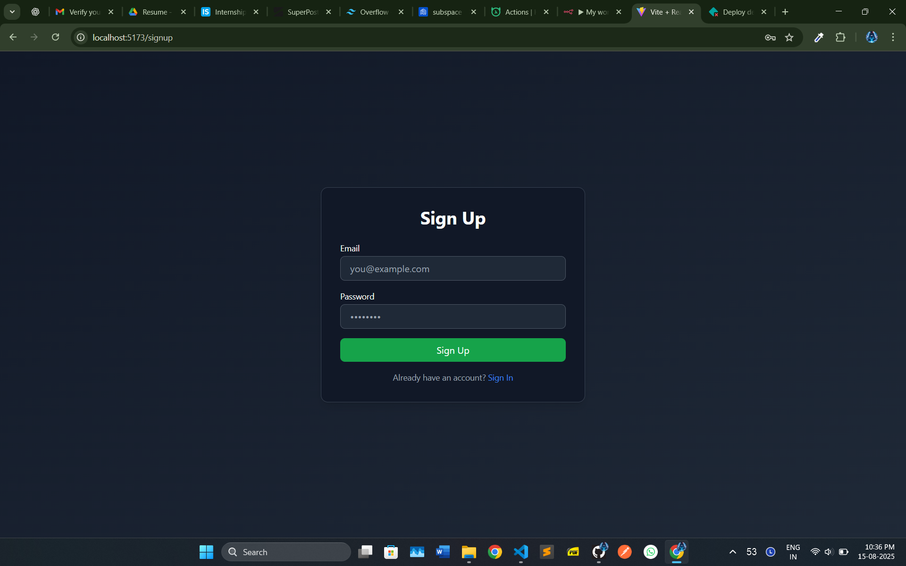

# Chatbot Application – Internship Assessment

## 📌 Overview
This project is a **Chatbot Application** built as part of the internship assessment.  
It features **email authentication**, a **real-time chat system**, and an **AI chatbot** powered through **n8n** and **OpenRouter**, with **Hasura GraphQL** as the backend.

---

## 🚀 Features
- **Email Sign Up / Sign In** using **Nhost Auth**
- **Real-time chat** with Hasura GraphQL subscriptions
- **Chat context preservation** – the chatbot remembers previous messages in the same conversation
- **Row-Level Security (RLS)** to ensure data privacy
- **n8n Workflow** integration for chatbot responses
- **Fully GraphQL-based** communication (no REST)
- **Deployed on Netlify** for easy access

---

## 🖼 Application Screenshots

### 🏠 Home Page

### 🔐 Sign In

### 📝 Sign Up

### 💬 Chat Page

### 

---

## Demo Video

[Watch the demo](public/demo_video/chatbot.mp4)

---

## 🛠 Tech Stack
- **Frontend:** React, Vite Tailwind CSS, React Markdown, Nodejs  22.17.1
- **Backend:** Hasura GraphQL, Nhost Auth
- **Automation:** n8n
- **AI API:** OpenRouter
- **Hosting:** Netlify

---

